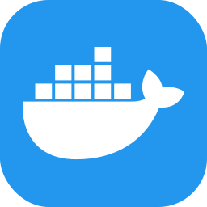
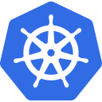

<!--CERTS SHIELDS -->
  [![LinkedIn][linkedin-shield]][linkedin-url]

## 
Gadagoju Shiva

Hello :wave: ! My name is <strong>Gadagoju Shiva</strong>. I'm a recent graduate from 2022, and I specialize in DevOps and AWS. I'm eager to contribute my skills in streamlining development processes and optimizing cloud solutions. Let's collaborate and build amazing tech solutions together! 🚀👨‍💻 #DevOps #AWS #TechEnthusiast

<!-- ## Credentials Showcase
 -->

## Certifications I have Accomplished

:medal_military: **AWS Certified Solutions Architect - Associate** -  [Verify](https://www.credly.com/badges/015ecab6-7110-4eb8-a07a-ef88d61bdfbc/public_url)

:medal_military: **AWS Certified Cloud Practitioner** -  [Verify](https://www.credly.com/badges/247ced3f-9c92-433c-92aa-c8895eb59d5f/public_url)

## I have demonstrated my skills through various compelling personal projects that highlight my expertise in AWS and DevOps practices. Here are some key projects I've been involved in:

<!-- projects -->
<!-- [![github][github-shield]][github-url] -->

  
Deployment of Java Spring Boot App on Kubernetes - ArgoCD :

  <ol>
    <ul>
    <li>Established a streamlined pipeline using Jenkins for continuous integration and deployment from GitHub.</li>
    <li>Successfully employed Docker for efficient application packaging and deployment.</li>
    <li>Orchestrated Kubernetes clusters with Minikube for scalability.</li>
    <li>Implemented ArgoCD for automated and reliable application deployments</li>
    <li><a href="https://github.com/GadagojuShiva/employee-management-java-spring-boot">GitHub Repository</a></li>
    <ul>
  </ol>
  

  
Containerization and Orchestration: NGINX Deployment

  <ol>
    <ul>
    <li>Implemented NGINX web server deployment on Kubernetes with 2 replicas.</li>
    <li>Employed labels and selectors for efficient deployment management.</li>
    <li><a href="https://github.com/GadagojuShiva/kubernetes-examples">GitHub Repository</a></li>
    <ul>
  </ol>
  

  

  
Containerization Django Application

  <ol>
    <ul>
    <li>Containerized a Python Django web app with Docker, ensuring streamlined deploymentand scalability while maintaining consistency across development, testing, and productionenvironments.      </li>
    <li><a href="https://github.com/GadagojuShiva/todo-application">GitHub Repository</a></li>
    <ul>
  </ol>
  

  
Lift & Shift to AWS Cloud Computing

  <ol>
      <ul>
        <li>Successfully completed a project to migrate an on-premises application to the AWS cloud.</a></li>
        <li>Modernized, scaled, and optimized costs during the migration.</a></li>
        <li>Utilized AWS services such as EC2, ELB, S3, Route 53, IAM, and CloudFormation.</a></li>
        <li><a href="https://github.com/GadagojuShiva/aws-projects/tree/main/AWS-LIFT-AND-SHIFT-PROJECT">GitHub Repository</a></li>
      </ul>
  </ol>

  
AWS CI/CD Pipeline for Python App

  <ol>
      <ul>
        <li>Orchestrated an end-to-end CI/CD pipeline using AWS tools (CodeCommit, CodePipeline, CodeBuild, CodeDeploy) for a Python application.</li>
        <li>Resulted in streamlined development, testing, and deployment on EC2 instances, enhancing development efficiency and code reliability.</li>
        <li><a href="https://github.com/GadagojuShiva/aws-projects/tree/main/AWS-End-To-End-CICD-Projects">GitHub Repository</a></li>
      </ul>
  </ol>

 

  
AWS Resource Tracking Project

  <ol>
      <ul>
        <li>This project is a simple Bash script to track resources in an AWS account. It lists information about EC2 instances, S3 buckets, Lambda functions, and IAM users.</li>
        <li><a href="https://github.com/GadagojuShiva/AWS_Resource_Tracking_Project">GitHub Repository</a></li>
      </ul>
  </ol>

<!-- - 

  
<strong>Secure VPC Setup with EC2 Instances</strong>

  <ol>
      <ul>
        <li>Designed and configured a VPC with custom IP ranges.</li>
        <li>Set up public and private subnets, route tables, and associations.</li>
        <li>Implemented network security using network access control lists (ACLs) and security groups.</li>
        <li>Provisioned EC2 instances and assigned IAM roles.</li>
        <li><a href="https://github.com/GadagojuShiva/aws-projects/tree/main/AWS_VPC_with_servers_in_private_subnets_NAT">GitHub Repository</a></li>
      </ul>
  </ol>

 -->

<!-- - 

  
<strong>AWS Cloud Resume Challenge</strong>

  <ol>
    <ul>
    <li>Developed a professional resume website using AWS, featuring a dynamic visitor counter, HTTPS security, and automated CI/CD pipelines with GitHub Actions.</li>
    <li><a href="https://github.com/GadagojuShiva/aws_cloud_resume_challenge">GitHub Repository</a></li>
    <ul>
  </ol>

 -->

<!-- - 

  
<strong>AWS Cloud Cost Optimization - Identifying Stale EBS Snapshots</strong>

  <ol>
      <ul>
        <li>Developed an AWS Lambda function to automate the identification and removal of redundant EBS snapshots.</li>
        <li>Led to substantial cost savings through efficient resource management.</li>
        <li><a href="https://github.com/GadagojuShiva/aws-projects/tree/main/AWS_Cloud_Cost_Optimization_using_lambda_functions">GitHub Repository</a></li>
      </ul>
  </ol>

 -->

<!-- - 

  
<strong>Serverless API with AWS Lambda, DynamoDB, and API Gateway
  </strong>

  <ol>
      <ul>
        <li>Designed and implemented a serverless API utilizing AWS Lambda, DynamoDB, and API Gateway for seamless data management. The API supports various DynamoDB operations, allowing for CRUD functionalities and includes comprehensive testing methods.</li>
        <li><a href="https://github.com/GadagojuShiva/aws-serverless-dynamodb-api">GitHub Repository</a></li>
      </ul>
  </ol>

 -->

## Skills:

  
  
  
  
  
  
  
  
  
  
  
  
  
  
  
  
  

## Get in Touch

- I'm passionate about cloud technologies and DevOps practices. Let's connect and explore opportunities to collaborate on innovative projects. Feel free to reach out to me: 
   
   
   &nbsp;&nbsp; 

## Online Portfolio:
- Explore more about my projects and skills on my website:
   
   
  

<!-- MARKDOWN LINKS & IMAGES -->
[linkedin-shield]: https://img.shields.io/badge/-LinkedIn-black.svg?style=for-the-badge&logo=linkedin&colorB=200
[linkedin-url]: https://www.linkedin.com/in/gadagoju-shiva/
[github-shield]: https://img.shields.io/badge/GitHub-Repository-blue?style=flat-square&logo=github
[github-url]: https://github.com/gadagojushiva/AWS_Resource_Tracking_Project

  
  
  

<!-- # Skills Matrix

| Skill | Proficiency |
|-------|-------------|
| AWS   | ⭐️⭐️⭐️⭐️   |
| Git   | ⭐️⭐️⭐️⭐️   |
| Kubernetes | ⭐️⭐️⭐️⭐️   |
| Docker | ⭐️⭐️⭐️⭐️   |
| GitHub | ⭐️⭐️⭐️⭐️   |
| Terraform | ⭐️⭐️⭐️⭐️   |
| Grafana | ⭐️⭐️⭐️⭐️   |
| Visual Studio | ⭐️⭐️⭐️⭐️   |
| Prometheus | ⭐️⭐️⭐️⭐️   |
| Maven | ⭐️⭐️⭐️⭐️   |
| Ansible | ⭐️⭐️⭐️⭐️   | -->

<!-- 
##### Cloud Services
  

**Description:** Proficient in utilizing cloud services, specializing in AWS, with expertise in Kubernetes for container orchestration and Docker for containerization.

##### Version Control
 

**Description:** Extensive experience in version control systems, particularly Git, and adept at managing repositories on GitHub.

##### Infrastructure as Code

**Description:** Skilled in designing and implementing Infrastructure as Code (IaC) using Terraform for efficient and scalable infrastructure provisioning.

##### Monitoring and Visualization
 

**Description:** Proficient in setting up robust monitoring solutions using Prometheus and creating insightful dashboards with Grafana.

##### Build and Automation
 

**Description:** Expertise in build automation using Maven and proficient in implementing configuration management with Ansible.

##### Integrated Development Environment (IDE)

**Description:** Comfortable and productive with Visual Studio as the primary Integrated Development Environment (IDE) for software development. -->

<!-- Add more sections or customize the content based on your skills -->

